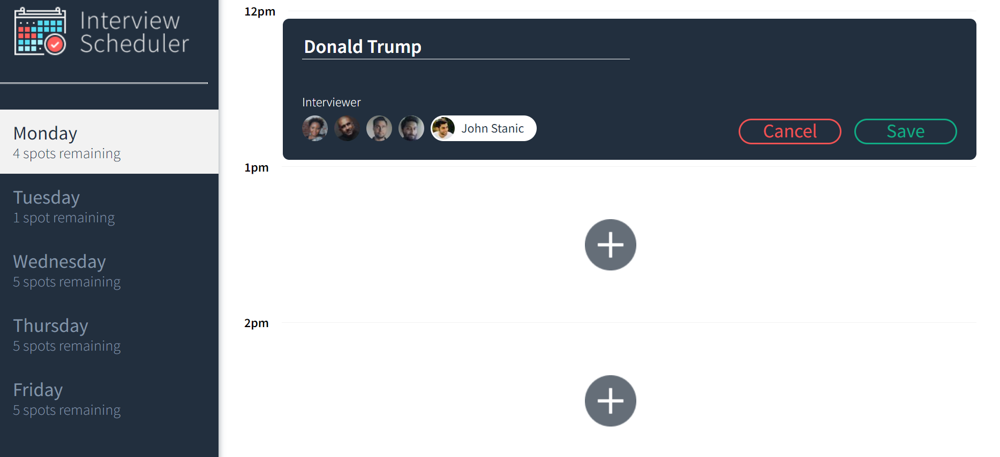
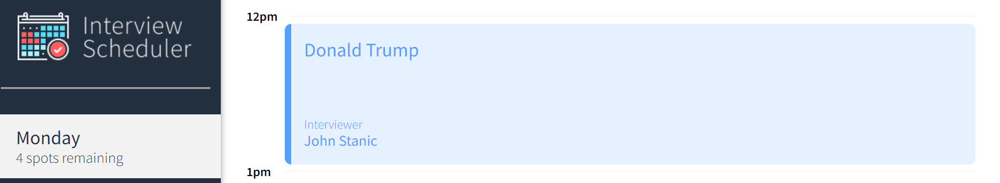
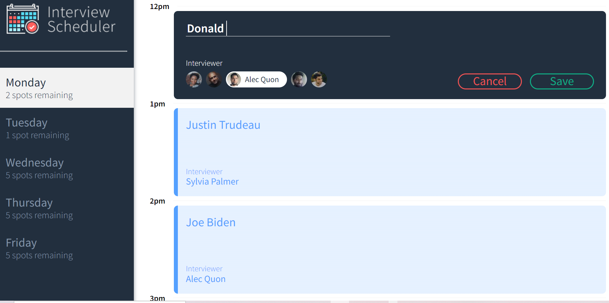
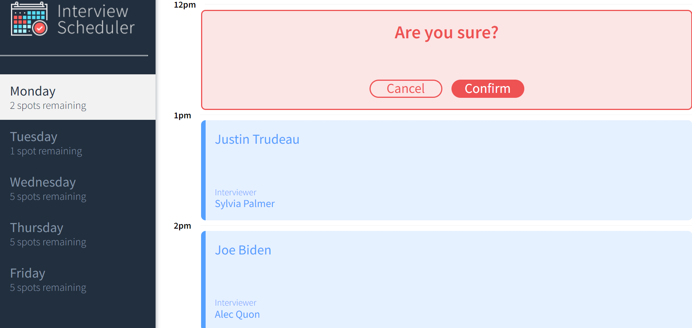
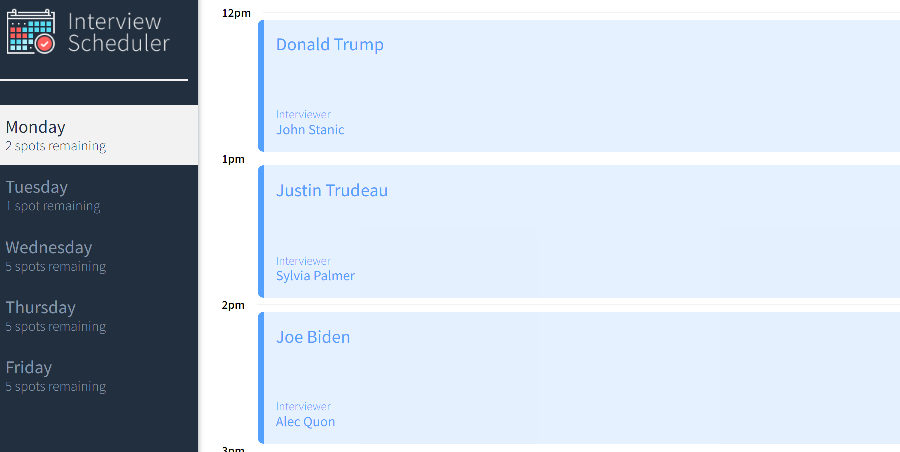
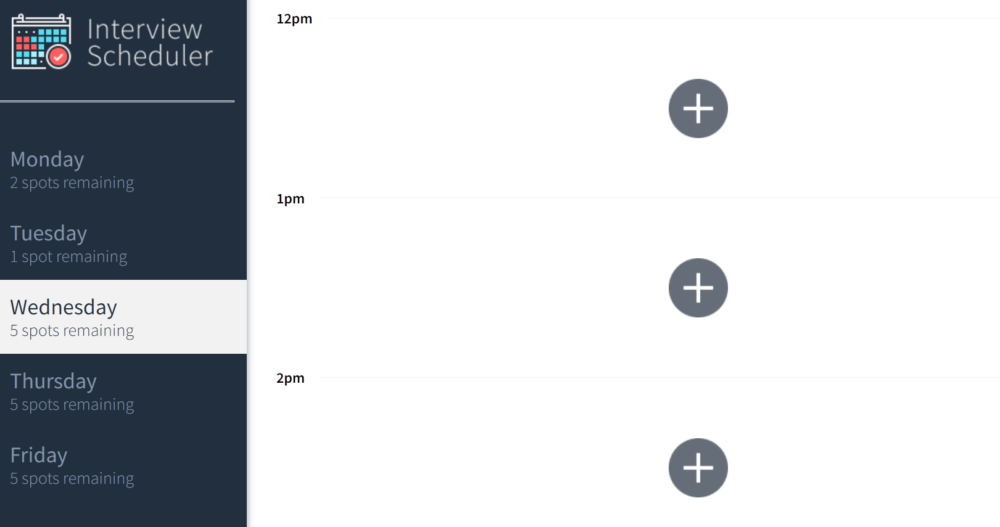
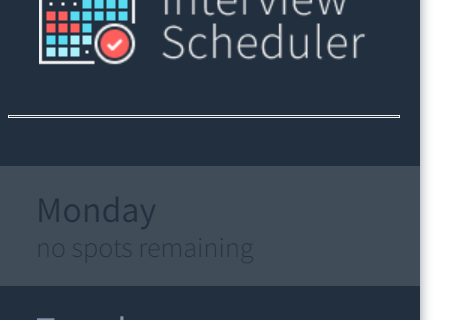

# Interview Scheduler

This project must be used with a back-end that contains all api needed
and given by Lighthouse Labs

## Project Description

This project is coded with JavaScript and its framework React 
Used storybook to make components and tested with Jest and Cypress.

## Project Features

User here can be student, that choose to book an appointment with Interviewer.
He can confirm, cancel, delete or update any appointment made.

## Setup

Install dependencies with `npm install`.

## Running Webpack Development Server

```sh
npm start
```

## Running Jest Test Framework

```sh
npm test
```

## Running Storybook Visual Testbed

```sh
npm run storybook
```

# Appointment On Creation
When the student needs to create an appointment


# Appointment Created
The Appointment is created and saved in the Database


# Appointment Edited
The Appointment is Edited to update it


# Appointment To Be Delted
The Appointment is Going to be deleted if the user click confirm
, and disappear from the database


# List All The Appointments Of A Day
For A day or all days we can list all the appointments


# Case where A day doesn't contain any appointment
This day is empty, still no appointment chosen for it


# Case where A day contain the maximum of appointments(5)
This day is full, no more place to book another appointment

